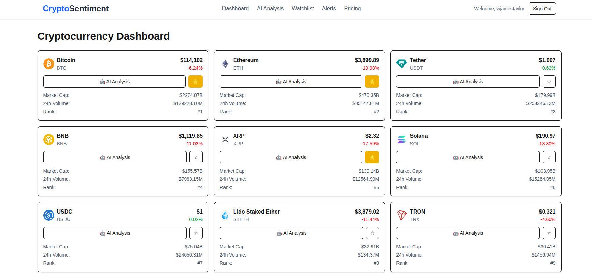

# CryptoSentiment 🚀

> AI-powered cryptocurrency sentiment analysis platform with real-time data and intelligent notifications



**Live Demo:** [https://lavish-patience-production-f0a0.up.railway.app](https://lavish-patience-production-f0a0.up.railway.app)

## ✨ Features

- 🤖 **AI Sentiment Analysis** - Real-time sentiment scoring with OpenRouter LLMs
- 📊 **Live Market Data** - Real-time prices and market data from CoinGecko
- 👁️ **Smart Watchlist** - Track cryptocurrencies with one-click AI analysis
- 🔐 **Secure Authentication** - Google OAuth with NextAuth.js
- 📱 **Responsive Design** - Mobile-first with shadcn/ui components
- 🚨 **Alert System** - Custom notifications across multiple channels
- 📈 **Type-Safe API** - Full-stack TypeScript with tRPC

*View [full feature list](docs/IMPLEMENTATION_CHECKLIST.md) for detailed capabilities and roadmap.*

## � Quick Start

### Prerequisites
- Node.js 18+ and npm/yarn/pnpm
- PostgreSQL database
- API keys: [CoinGecko](https://coingecko.com/api), [OpenRouter](https://openrouter.ai)

### Installation

```bash
# Clone and install
git clone https://github.com/wjamestaylor/cryptosentiment.git
cd cryptosentiment
npm install

# Configure environment
cp .env.example .env.local
# Edit .env.local with your API keys and database URL

# Setup database
npx prisma generate
npx prisma db push

# Start development server
npm run dev
```

Open [http://localhost:3000](http://localhost:3000) to view the app.

*For detailed setup instructions, see [Development Setup](DEVELOPMENT_SETUP.md).*

## � Tech Stack

**Frontend:** Next.js 15, TypeScript, Tailwind CSS, shadcn/ui  
**Backend:** tRPC, Prisma, PostgreSQL, NextAuth.js  
**AI/Data:** OpenRouter, CoinGecko, WhaleAlert, NewsData.io  
**Testing:** Jest (606+ tests, 42 suites, 100% pass rate)  
**Deployment:** Railway, Docker

*View [Test Coverage Report](docs/TEST_COVERAGE_REPORT.md) for quality metrics.*

## ⚙️ Configuration

### Environment Variables

Core requirements for `.env.local`:

```bash
# Database
DATABASE_URL="postgresql://..."

# Authentication  
NEXTAUTH_SECRET="your-secret-key"
GOOGLE_CLIENT_ID="your-google-client-id"
GOOGLE_CLIENT_SECRET="your-google-client-secret"

# APIs
OPENROUTER_API_KEY="sk-or-..."  # AI analysis
COINGECKO_API_KEY="CG-..."     # Crypto data (optional)
```

*See [Security Setup](SECURITY-SETUP.md) for complete configuration guide.*

### Development Commands

```bash
npm run dev          # Start development server  
npm run build        # Build for production
npm run test         # Run test suite
npm run db:studio    # Open database admin
npm run db:push      # Sync database schema
```

## � Deployment

### Railway (Production)
```bash
# Install Railway CLI
npm install -g @railway/cli

# Login and deploy
railway login
railway link
railway up
```

### Docker
```bash
docker build -t cryptosentiment .
docker run -p 3000:3000 cryptosentiment
```

*For production deployment and email setup, see [Production Email Setup](PRODUCTION_EMAIL_SETUP.md).*

## 📚 Documentation

| Document | Description |
|----------|-------------|
| [Implementation Checklist](docs/IMPLEMENTATION_CHECKLIST.md) | Development progress and roadmap |
| [Development Setup](DEVELOPMENT_SETUP.md) | Detailed setup and installation |
| [Security Setup](SECURITY-SETUP.md) | Security configuration guide |
| [Test Coverage](docs/TEST_COVERAGE_REPORT.md) | Quality metrics and testing |

## 🤝 Contributing

1. Fork the repository
2. Create feature branch: `git checkout -b feature/amazing-feature`  
3. Commit changes: `git commit -m 'Add amazing feature'`
4. Push to branch: `git push origin feature/amazing-feature`
5. Open Pull Request

Read the [Implementation Checklist](docs/IMPLEMENTATION_CHECKLIST.md) for current priorities and development status.

## 📄 License

MIT License - see [LICENSE](LICENSE) file for details.

## 🙏 Acknowledgments

Built with: [Next.js](https://nextjs.org) • [OpenRouter](https://openrouter.ai) • [CoinGecko](https://coingecko.com) • [Railway](https://railway.app)

---

**CryptoSentiment** - Real-time crypto sentiment analysis powered by AI
